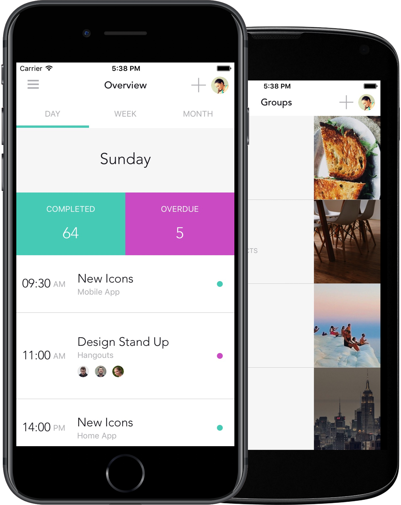

# React Native DO

Author: [William Candillon](http://github.com/wcandillon)

React Native DO is a starter kit for React Native and NativeBase.
You can use them as turn key solutions for your next project.
This project has been rewritten using es6 with flow annotations for type checking.
The visual design can easily be customized and all aspects of the app are implemented: from navigation using react-navigation to state management using mobx. Currently this project only works in portrait mode.

