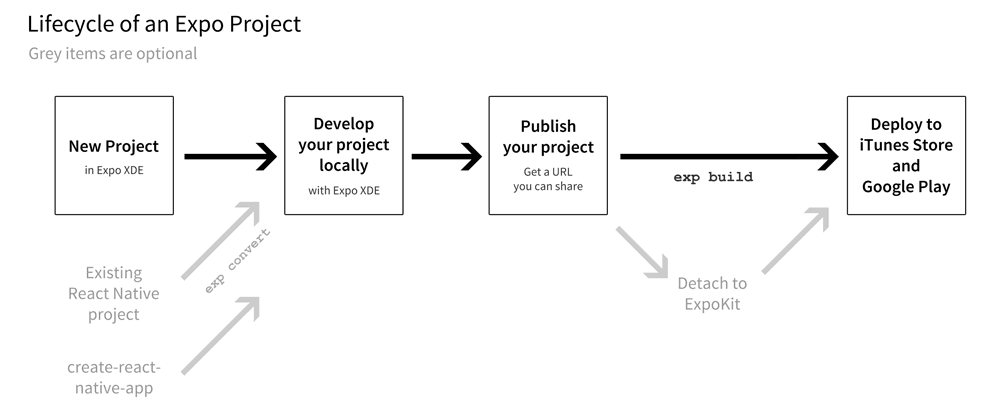

# Technologies Used

The started kit is built using the latest de-facto components for building a React Native app.
These are extremely important in order to keep your development as lean and efficient as possible. 

## NativeBase

[NativeBase](https://github.com/GeekyAnts/NativeBase) is the most versatile UI component available for React Native.
It provides a large collection of cross-platform components that can easily be customized.
The library is extremely robust and has a low barrier to entry.

## React Navigation
[React Navigation](https://reactnavigation.org/) is quickly becoming the de-facto standard for implementing navigation in React Native. The library is performant, well-designed, and very robust.

## Flow

When it comes of making your app development lean and efficient, the most overlooked technology is probably static typing.
It can be quicker to prototype something without it. However, as soon as you actually start to build something, you absolutely need them: The more pressure you put on the type checker, the better.
This is why React Native DO is using [Flow](https://github.com/facebook/flow), a static type checker for JavaScript.
Flow enables you to safely refactor your code and catch most of the mistakes you might make.

To run flow on this project, you can use the command below.

```bash
$ yarn flow
```

or 

```bash
$ npm run flow
```

## ESLint

We use eslint to check the quality of the code base. To lint the source code, you can use the command below.

```
$ yarn lint
```

or 

```
$ npm run lint
```

## Expo

The project is using [Expo](https://github.com/expo). 
This means that you don’t need to install XCode or Android Studio to develop your app.
You can test it on an iOS device without buying a developer account from Apple.
The development app can be shared to beta testers very easily via a link or QR code. As you go further in the development of your app, you might want to “detach” the project in order to have your own built setup.
This is useful if you need to write custom native code for instance.



However, expo covers a lot of mobile use cases and it is possible to publish a full-fledged app on the Apple App Store and Google Play Store without “detaching”.
Last but not least, expo enables you to update your app instantaneously without any app store update in the same manner as updating an HTML page.

## MobX

We use [MobX](https://github.com/mobxjs/mobx) for the state management in this project.
Please checkout the documentation of this project and you can also look [this example](https://docs.nativebase.io/docs/examples/MobxCounterExample.html) from NativeBase.

